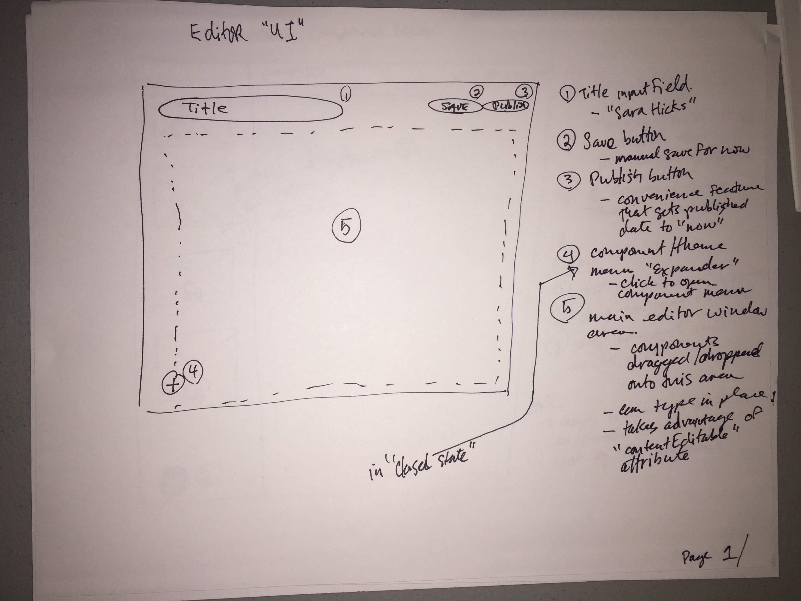

# Editor UI

The Editor UI is the primary screen of the front-end Ember app.  The editor allows an author to drag and drop compoents in a particular theme onto the the main editor area.  You can reorder the compoenents, and change the text content.  The goal is to provide a set of predefiend components which an author can choose from, and change the visual layout of the article.  An author can also save and publish the article when ready.

The editor UI is heavily influenced by Qards by Design Modo and Medium.com's "text editor".

## UI Elements

1. Title input field
-- This field is the main title of the article/interview/post e.g. "Sara Hicks"
1. Save Button
-- This button is meant only to save the current changes of the article.  It does not change it's status from (i.e. from draft to publised)
1. Publish Button
-- Used to change the status of the article from draft to published
1. Theme/Component Menu Toggle button
-- Toggles the Theme/Component Menu in/out of the viewport (i.e. expands it into the browser's viewport)
1. Editor Area
-- This is the main text editing area.  The components are dragged from the left menu and dropped onto this area.  You are then able to enter text and modify the contents of the component.  You can also reorder compoents that are available in the Editor Area.