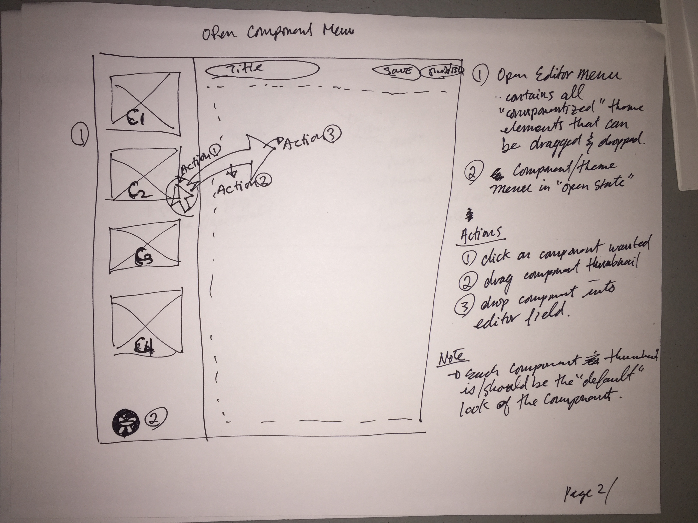

# Theme/Component Menu

The Theme/Component Menu is the primary way for an author to add new sections to an article.  This allows an author to dynamically create/update their article layout by using predefined/coded web components.

